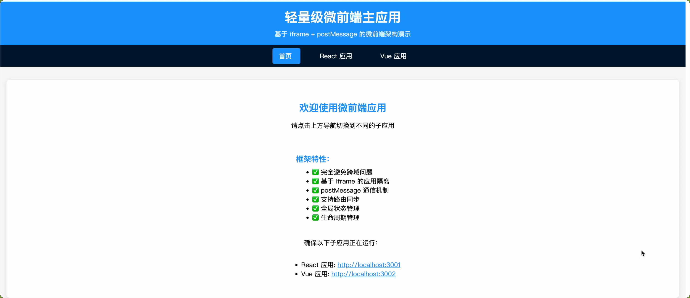

# 轻量级微前端框架

[](https://opensource.org/licenses/MIT)
[](https://nodejs.org/)
[](https://vuejs.org/)
[](https://reactjs.org/)
[](CONTRIBUTING.md)
[](https://github.com/your-username/micro-frontend-framework/issues)
[](https://github.com/your-username/micro-frontend-framework/stargazers)

基于 iframe + postMessage 的微前端解决方案，完全避免跨域问题。

## 🌟 为什么选择这个框架？

传统的微前端方案（如 qiankun、single-spa）虽然功能强大，但在实际使用中经常遇到：

- 复杂的跨域配置问题
- 样式隔离冲突
- JavaScript 沙箱兼容性问题
- 学习成本高

我们的方案通过 iframe 天然隔离的特性，彻底解决了这些问题，让微前端变得简单可靠。

[](docs/xw_20250808173637.mp4)

## 🚀 快速开始

### 环境要求

- Node.js >= 14.0.0
- npm >= 6.0.0

### 安装和运行

```bash
# 克隆项目
git clone https://github.com/your-username/micro-frontend-framework.git
cd micro-frontend-framework

# 安装所有依赖
npm run install:all

# 启动所有应用
npm run start:all
```

### 访问应用

- 🏠 **主应用**: http://localhost:3000
- ⚛️ **React 应用**: http://localhost:3001
- 💚 **Vue 应用**: http://localhost:3002

> 💡 **提示**: 确保端口 3000、3001、3002 没有被占用

## 📁 项目结构

```
├── main/                    # 主应用 (Vue 3 + Vite)
│   ├── src/
│   │   ├── micro-frontend.js    # 微前端框架核心
│   │   ├── main.js              # 应用入口
│   │   └── App.vue              # 主组件
│   ├── package.json
│   └── vite.config.js
├── react-app/               # React 子应用
├── vue-app/                 # Vue 子应用
├── shared/                  # 共享 SDK
│   └── micro-app-sdk.js     # 子应用通信 SDK
├── package.json             # 工作空间配置
└── start-all.js             # 启动脚本
```

## ✨ 特性

- ✅ **零跨域问题** - 基于 iframe 完全隔离
- ✅ **轻量级** - 核心代码不到 200 行
- ✅ **框架无关** - 支持任何前端框架
- ✅ **双向通信** - 基于 postMessage 的通信机制
- ✅ **路由同步** - 支持浏览器前进后退
- ✅ **全局状态** - 跨应用状态共享
- ✅ **生命周期** - 完整的应用生命周期管理

## 🛠 可用脚本

```bash
# 启动所有应用
npm run start:all

# 单独启动主应用 (开发模式)
npm run dev:main

# 构建主应用
npm run build:main

# 启动 React 子应用
npm run start:react

# 启动 Vue 子应用
npm run start:vue

# 安装所有依赖
npm run install:all
```

## 📖 详细文档

查看 [MICRO_FRONTEND_README.md](./MICRO_FRONTEND_README.md) 了解：

- 完整的 API 文档
- 通信机制详解
- 扩展功能说明
- 最佳实践指南

## 🎯 优势对比

相比 qiankun、single-spa 等方案：

- **无跨域问题** - 不需要配置 CORS
- **完全隔离** - CSS 和 JS 完全隔离
- **学习成本低** - 简单易懂的实现
- **维护简单** - 核心代码量少

## 🚨 注意事项

- iframe 会增加一定的内存占用
- 不适合需要 SEO 的场景
- 移动端需要特别处理滚动问题

## 🤝 贡献

我们欢迎任何形式的贡献！请查看 [贡献指南](CONTRIBUTING.md) 了解详情。

### 贡献者

感谢所有为这个项目做出贡献的开发者！

## 📄 许可证

本项目基于 [MIT 许可证](LICENSE) 开源。

## 🔗 相关链接

- [详细文档](MICRO_FRONTEND_README.md)
- [贡献指南](CONTRIBUTING.md)
- [问题反馈](../../issues)
- [功能请求](../../issues/new?template=feature_request.md)

## 📊 项目状态

- ✅ 核心功能完成
- ✅ 基础文档完善
- 🚧 单元测试开发中
- 🚧 性能优化进行中

---

**从 qiankun 迁移？** 这个框架提供了更简单、更可靠的微前端解决方案！

⭐ 如果这个项目对你有帮助，请给我们一个 Star！
